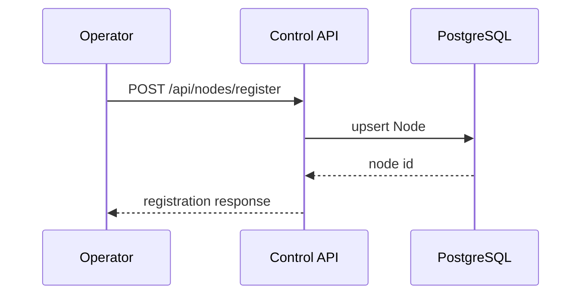
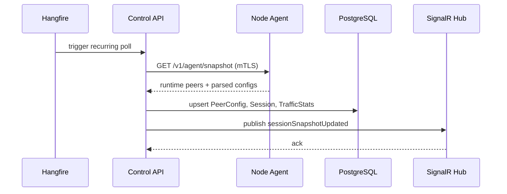
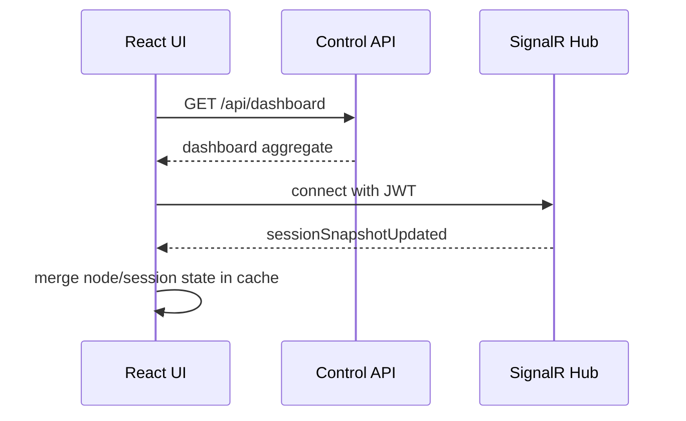

# VPN Control System Architecture

## 1. High-level architecture

This implementation uses a pull-first control plane:

- `VpnNodeAgent` runs on every VPN node as a stateless container.
- `VpnControlPlane.Api` polls agents over mTLS on a fixed interval using Hangfire.
- PostgreSQL is the system of record for nodes, users, peer configs, sessions, and traffic snapshots.
- SignalR pushes aggregated session updates to the React UI.
- The existing desktop client in this repository is left untouched; the new control-plane workspace is additive.

Why pull-first:

- It avoids inbound connectivity requirements from remote nodes into the control plane.
- It keeps the node agent stateless and resource-light.
- It is operationally simpler for 5 to 50 nodes.
- It leaves room for a future push or streaming mode without changing the domain model.

## 2. Component breakdown

### Node agent

Responsibilities:

- Execute `wg show all dump`.
- Parse runtime peers and transfer counters.
- Parse mounted WireGuard or Amnezia config files.
- Merge runtime state with config metadata and expose `/v1/agent/snapshot`.

Production choices:

- Stateless process. No local database or cache.
- Certificate-gated HTTPS endpoint only.
- Designed for host-network Docker deployment with `/etc/wireguard` mounted read-only.

Trade-offs:

- Pulling `wg show all dump` on demand is simpler than keeping an in-memory watcher, but per-request latency is slightly higher.
- Config parsing is file-based; if the VPN container stores config elsewhere, the deployment must mount that path explicitly.

### Control plane API

Responsibilities:

- Register nodes.
- Poll node agents.
- Normalize snapshots into domain entities.
- Persist state in PostgreSQL.
- Push real-time updates to operators over SignalR.

Architecture:

- Clean Architecture split into `Domain`, `Application`, `Infrastructure`, `Api`.
- CQRS-style commands and queries with explicit handlers.
- Hangfire recurring job for polling.

Key flows:

- `RegisterNodeCommand` upserts node registration.
- `UpsertNodeSnapshotCommand` applies runtime telemetry into peer configs, sessions, and traffic samples.
- `GetDashboardQuery` returns a UI-ready dashboard aggregate.

### Frontend

Responsibilities:

- Show node fleet health.
- Show active sessions in near real time.
- Manage users.
- Visualize traffic samples.

Implementation choices:

- React + TypeScript.
- React Query for fetch, refresh, and mutation orchestration.
- SignalR for live updates.
- No charting dependency yet; the traffic view uses lightweight CSS bars to keep the initial bundle small.

## 3. Security model

### Agent security

- Agents are not intended for direct public exposure.
- The agent requires a client certificate on every protected endpoint.
- Allowed client thumbprints are configured locally on the node agent.

### Control plane security

- UI clients authenticate with JWT bearer tokens.
- SignalR shares the same bearer token, including query-string transport fallback.
- The control plane uses a configured client certificate for outbound agent calls.

### Operational hardening

- Put agents on private addresses or overlay networks only.
- Rotate client and server certificates with an internal CA.
- Replace the symmetric JWT signing key with OIDC or an HSM-backed issuer in production.
- Add rate limits and audit logging before internet exposure.

## 4. Data model

Core entities:

- `Node`: registered VPN node and current health.
- `VpnUser`: operator-managed or auto-materialized VPN identity.
- `PeerConfig`: normalized peer config mapped to a node and user.
- `Session`: current or last observed peer session state.
- `TrafficStats`: time-series traffic samples captured on every poll.

Schema file:

- [`database/schema.sql`](/c:/Users/rrese/source/repos/vpn/database/schema.sql)

Persistence trade-offs:

- `TrafficStats` is append-only and will grow quickly. A retention policy or TimescaleDB partitioning should be added once traffic history becomes a hard requirement.
- `Session` is modeled as current-state plus last counters to keep the dashboard query cheap.

## 5. Folder structure

```text
vpn/
|-- architecture.md
|-- database/
|   `-- schema.sql
|-- deploy/
|   |-- docker-compose.platform.yml
|   `-- node-agent.compose.sample.yml
|-- frontend/
|   `-- control-plane-ui/
|       |-- Dockerfile
|       `-- src/
|-- src/
|   |-- ControlPlane/
|   |   |-- VpnControlPlane.Domain/
|   |   |-- VpnControlPlane.Application/
|   |   |-- VpnControlPlane.Infrastructure/
|   |   `-- VpnControlPlane.Api/
|   |-- NodeAgent/
|   |   `-- VpnNodeAgent/
|   `-- Shared/
|       `-- VpnControlPlane.Contracts/
|-- tests/
|   `-- VpnControlPlane.Application.Tests/
`-- VpnControlPlane.sln
```

## 6. API surfaces

Control plane:

- `POST /api/nodes/register`
- `GET /api/nodes`
- `GET /api/nodes/{nodeId}/sessions`
- `GET /api/dashboard`
- `POST /api/users`
- `GET /hubs/sessions`

Agent:

- `GET /healthz`
- `GET /v1/agent/snapshot`

Example request files:

- [`VpnControlPlane.Api.http`](/c:/Users/rrese/source/repos/vpn/src/ControlPlane/VpnControlPlane.Api/VpnControlPlane.Api.http)
- [`VpnNodeAgent.http`](/c:/Users/rrese/source/repos/vpn/src/NodeAgent/VpnNodeAgent/VpnNodeAgent.http)

## 7. Sequence diagrams

### Node registration



### Polling and aggregation



### UI update



## 8. Amnezia and WireGuard integration

Current implementation:

- Runtime state comes from `wg show all dump`.
- Config metadata comes from mounted config files.
- Unknown peer properties are preserved in JSON metadata.
- If Amnezia-specific keys are present, the parser marks the peer as `amnezia-wireguard`.

Recommended config convention for user mapping:

```ini
# vpn-user-id=user-001
# vpn-email=alice@example.com
# vpn-display-name=Alice Adams
[Peer]
PublicKey = ...
AllowedIPs = 10.8.0.2/32
```

Trade-off:

- This is intentionally metadata-driven instead of full binary reverse engineering. It is robust if the control plane is the source of truth for generated configs.
- If Amnezia stores materially different formats outside INI-like files, add parser adapters behind `IWireGuardConfigParser` rather than branching inside the control plane.

## 9. Phase 2: custom VPN client feasibility

Feasibility: high for replacing the UI and config distribution layer, medium for embedding the full dataplane.

Recommended phase split:

1. Keep WireGuard as the transport and only replace config generation plus UX.
2. Add signed config download and device enrollment from the control plane.
3. Only then evaluate embedding a userspace tunnel.

### Reuse strategy

- Reuse control-plane provisioning to issue peer configs per device.
- Keep server-side nodes fully WireGuard compatible.
- Build a custom desktop or mobile client that consumes a device-specific config envelope from the control plane.

### Libraries

- `wireguard-go`: userspace WireGuard engine for non-kernel environments.
- `wireguard-windows`: native tunnel service for Windows integration.
- `Wintun`: high-performance Windows tunnel adapter.
- `wireguard-nt` or platform-native bindings where available.
- Existing mobile platform WireGuard libraries if mobile becomes a target.

### Risks

- TUN lifecycle and route management are platform-specific and operationally expensive.
- Embedded VPN engines increase attack surface and support burden.
- App-store or endpoint-security restrictions can complicate distribution.
- Protocol deviations beyond standard WireGuard semantics will sharply increase maintenance cost.

Recommendation:

- Do not replace the transport in phase 2.
- Replace enrollment, identity, UX, and device posture first.
- Treat an embedded tunnel as a later optimization only if stock WireGuard UX becomes the actual bottleneck.
